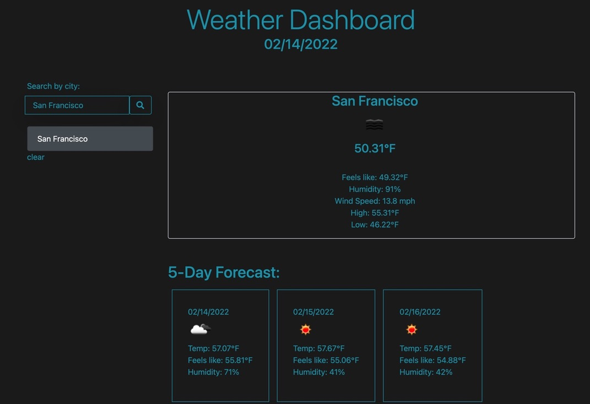

# Weather Dashboard

## About
* A weather dashboard that uses the [Open Weather API](https://openweathermap.org/current). To utilize the weather dashboard, you type in the name of any city and the dashboard will display its current weather conditions as well as the area's five-day forecast.

## Features
* A modern, moody, minimalist layout.
* Displays details such as the current temperature as well as what it "feels like" instead of that temperature. This takes into consideration factors such as wind chill and humidity.
* Displays the high and low temperatures of the day.
* Displays wind speed.
* Displays a five-day forecast of that city which includes the current temperature, "feels like" temperature, and humidity.
* Finally, the app displays previously searched cities. If clicked, the app will re-display the city's weather details.

## Technologies
* JavaScript
* Bootstrap
* CSS
* HTML
* Open Weather API
* Netlify for deployment

## License
* MIT

## Link
* [Deployed Site]([https://arumbaua366.github.io/ar_weather-dash/])

## Future Developments
* A day and night mode
* 10-day forecast
* Possibly include other weather parameters

